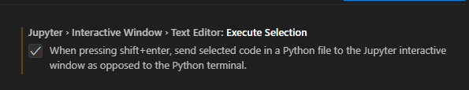

# Python Files

## From Jupyter Notebooks to Python Files

Jupyter Notebooks (`.ipynb`) offer an excellent interactive learning environment for Python, allowing code execution in cells with immediate output, as well as neighbouring markdown cells for detailed explanation of code.

However, as our Python projects grow larger and more complex, and as we move towards deploying our code in production environments, it's beneficial to organise our code into Python files (`.py`) for several reasons:

1. **Clearer Separation of Concerns**: Organising code into Python files allows for a clear separation of different concerns within a project. For example, you might have one Python file dedicated to handling database interactions, another for formatting and another for handling user interface interactions. This separation makes it easier to understand and maintain the codebase because each file is responsible for a specific aspect of the application.

2. **Improved Reusability**: When code is stored in Python files, it becomes easier to reuse that code across different parts of the project or even in entirely separate projects. Objects defined in one file can be imported and used in other files, promoting code reuse and reducing duplication.

- **Enhanced Version Control**: Python files are also better suited for version control systems like Git. Jupyter Notebooks are not stored as plain text files but rather as JSON documents containing code, markdown, and output cells. This structure can lead to conflicts and difficulties in tracking changes compared to traditional text-based files like Python files.

- **Better Testing and Debugging**: Python files enable the use of standard debugging tools, automated tests, and static code analysis, ensuring code works as expected and errors are caught early.

- **Predictable Execution Environment**: Python files offer a clean execution environment with each run, preventing unexpected behavior caused by variable state persistence in Jupyter Notebook cells. For example, if a variable is accidentally modified in one cell, it can impact the execution of code in subsequent cells. Versues, when we run code from a Python file, each execution starts with a clean slate.

- **Standard Practice for Deployment**: Lastly, organising code into Python files is standard practice for deployment in larger applications or systems. Essentially it makes it easier to package, distribute, and deploy our code alongside other components of the application.

## Executing a Simple Python File

First let's create a Python file `my_script.py` which contains the following contents:

```Python
# my_script.py
def hello_world():
    print('hello world')

hello_world()
```

There are various methods to execute a Python file, such as using the command line or importing it into another Python file. We will delve into the latter method later, so for now, let's focus on executing Python files from the command line:

1. From the command line, navigate to the directory where your Python file is located.
2. **Run the Python File**: Use the `python` command followed by the name of your Python file to execute it:

``` shell
python your_file.py
```

Replace `your_file.py` with the name of your Python file.
So in our case, we would run:

``` shell
python my_script.py
```

This is using a relative path, alternatively, you can use an absolute path to execute Python files located outside of the current directory:

``` shell
python /path/to/your_file.py
```

Replace `/path/to/your_file.py` with the absolute path to your Python file.

**Note**: there is another way to run a Python file from the command line, and that is by using the following syntax:

``` shell
python -m your_file
```

The differece between the two is that the latter way treats `your_file` as a module rather than a standalone script - more on this later.

## Using VS Code's Play Button

VS Code provides a convenient feature for executing Python files directly within the editor using the Play button:

- Open Python File: Open the Python file you want to execute in VS Code.
- Locate the Play Button: In the top right corner of the editor window, you'll find the Play button.
- Click the Play Button: Simply click on the Play button to execute the Python file. VS Code will run the file using the Python interpreter configured in your workspace and display the output in the integrated terminal.

## Using VS Code's Interactive Window

VS Code offers a solution for maintaining interactivity when working with Python files, by integrating Jupyter functionality into Python files. This is achieved through its Interactive window feature. To use the Interactive window, you can do either of the following:

- Use the keyboard shortcut `Shift+Enter` while having a Python file open to execute the current selection or line in the Interactive window. **Note**: you will need to ensure in Settings, (`Ctrl+,`), `Jupyter › Interactive Window › Text Editor: Execute Selection` is ticked.



- Use `#%%` comment tags within your Python file to indicate code cells, allowing you to execute individual cells in the Interactive window. When the Python detects a code cell, it adds `Run Cell`, `Debug Cell` and `Run Below` or `Run Above`, depending on whether it's the first or subsequent cell indicated in the Python file. Selecting a command runs the cell in the interactive window.
