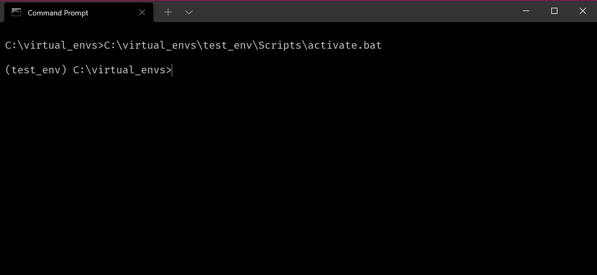
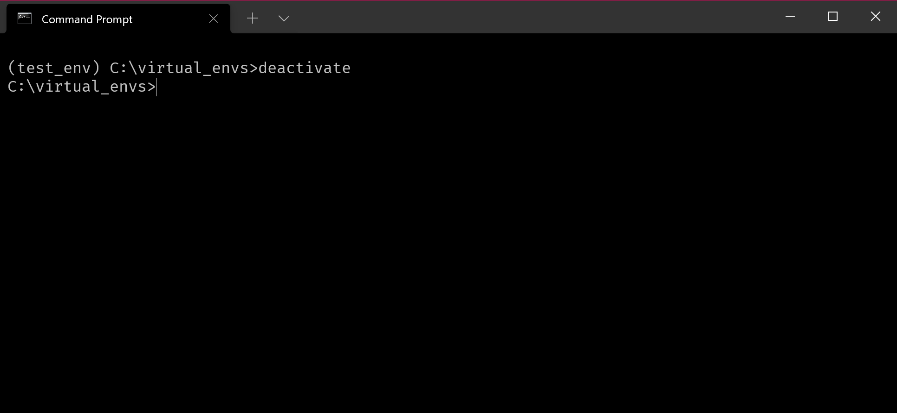
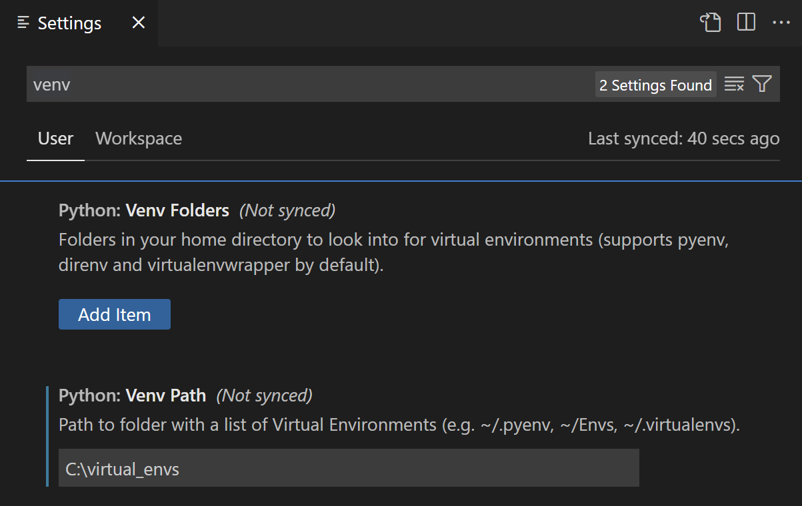
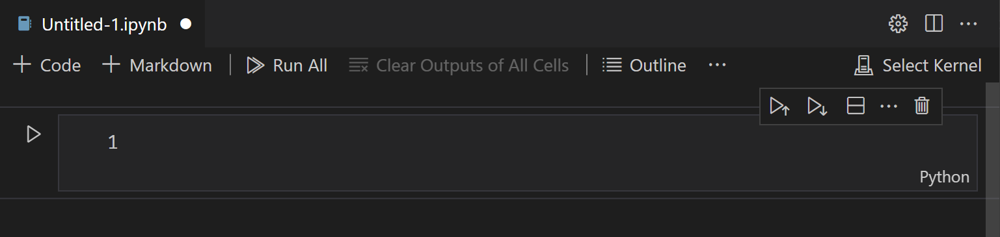

# Virtual Environments

Virtual environments allow us to isolate and manage different versions of the same Python packages on our computer. This is useful when we are working on different projects at the same time and each project depends on a different version of the same package. For example, we may be simultaneously working on two projects, one a data science project that requires packages such as numpy, pandas, jupyter, matplotlib and scikit-learn and another web development project that requires jupyter, requests, fastapi and uvicorn. 

Popular Python packages are constantly updated and this results in new functionalities getting added and existing functionalities getting deprecated (i.e. they are discouraged from being used as they would be removed in a future version).

A lot of times, these changes can be code breaking. For example, a piece of software written six months ago with a previous version of Pandas may no longer work if some of the functions used are no longer available. Therefore, developers tend to isolate and use specific versions for each project, meaning there will be a different virtual environment for each project. Then when working with that project, that specific virtual environment is used, i.e activated. 

Continuing from the previous example, for the data science project, we might create a virtual environment named `data_science_env` where we install specific versions of packages like numpy, pandas, jupyter, matplotlib, and scikit-learn. Similarly, for the web development project, we might create another virtual environment named `web_dev_env` with its own set of package versions.

When we switch between projects, we activate the corresponding virtual environment. 

Here, we will look at the built-in `venv` module from the Python Standard Library. 

## Pip

Pip (https://pip.pypa.io/en/stable) is the reference package installer for Python. It allows us to install, update and remove packages in virtual environments or outside virtual environments as well.

### List all packages installed in base (global) Python installation

> python -m pip list

This command lists all the packages installed with the base Python (i.e. outside of any virtual environments) on the computer. It also shows the installed version for each package.

### Creating a new virtual environment
Virtual environments are created in folders and a virtual environment contains all the necessary files to run Python and other installed packages. 

The following commands assume that we are using a Windows operating system and using the Command Prompt (Start > CMD).

To create a new virtual environment, we use the syntax `python -m venv C:\path\to\virtual\env`, replacing `C:\path\to\virtual\env` with the path to the directory we wish to create for the virtual environment.

For example, to create a virtual environment called `test_env` in `C:\virtual_envs`, 

> python -m venv C:\virtual_envs\test_env

This will create a new folder called `virtual_envs` in `C:\` (if it doesn't already exist), inside which a sub-folder called `test_env` will be created. 

In order to activate this environment, we have to run the file `activate.bat` inside the `Scripts` folder inside `test_env`.

> C:\virtual_envs\test_env\Scripts\activate.bat

When you activate a virtual environment, you essentially instruct your operating system to prioritise the Python interpreter and packages installed within that environment over those installed globally on your system.

Once it is activated, the command prompt will include the environment name on the left (as seen below) indicating that this is the activated virtual environment.

Now, try listing the packages installed again in this activated virtual environment. You will notice that only two packages `setuptools` and `pip` are installed here. This is a freshly created environment where we can install any packages that we require for the project we have created the environment for. 

### Installing packages in the new environment

Python packages can be installed using the following command `python -m pip install <package_name>`.

For example, to install jupyter in this new environment to use notebooks, we will run,

> python -m pip install jupyter

This will not only install jupyter but also the packages it depends on (also known as dependencies in Python).

Try listing the packages once again in this new environment.

**Note**: We can also install specific versions of a package by running `python -m pip install <package_name>==<version_number>`.

For instance, the current Pandas version (as of February 2024) is 2.2.1. However, if we wanted to install Pandas version 1.4.0, we would run

> python -m pip install pandas==1.4.0

To upgrade an existing package, we can run 

> python -m pip install --upgrade <package_name>

To deactivate an environment, we can simply run `deactivate`. 

> deactivate

This will remove the environment name from the left of the prompt (as shown below) indicating that the environment has been deactivated. 

**Note**: Deleting the virtual environment is as simple as deleting the folder in which the environment is located. 

## Using the virtual environment in VSCode

Go to VS Code Settings (Ctrl+,) and search for venv. Add the directory where the virtual environment folders are located to `Python: Venv Path`.

In our example, this will be `C:\virtual_envs`

Open Command Palette (`Ctrl+Shift+P`) and search for `Developer: Reload Window` and run the command. This will reload the VSCode Window and add the virtual environment we have created to the discovery path.

Now, if we create a new Jupyter notebook, we can switch to this virtual environment by clicking on the `Select Kernel` button on the top right of the screen (as shown below) and selecting the virtual environment in the menu that appears at the top of the screen.

## Creating a snapshot of the installed packages

It is often useful to create a snapshot of all the installed packages along with their version numbers so that the same setup can be recreated on different machines. 

This can be done by creating a `requirements.txt` file which contains a list of the packages along with their versions. pip allows us to do this by using the `python -m pip freeze` command:

> python -m pip freeze > requirements.txt

This creates the file in the current folder. This text file can be packaged and sent along with the project source code so that it can be used to install the packages on another machine.

To install all the packages from a requirements file, we can run:

> python -m pip install -r requirements.txt

For more information about the requirements file format, see <https://pip.pypa.io/en/stable/reference/requirements-file-format/>

